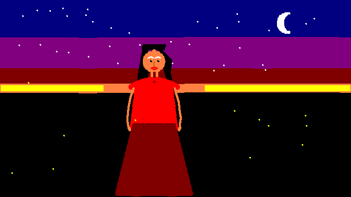
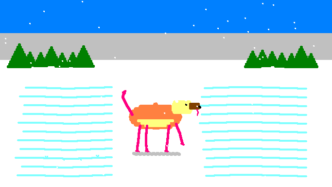
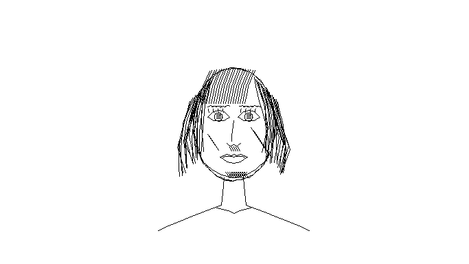
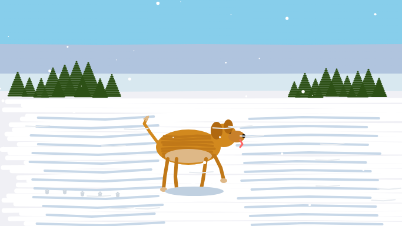
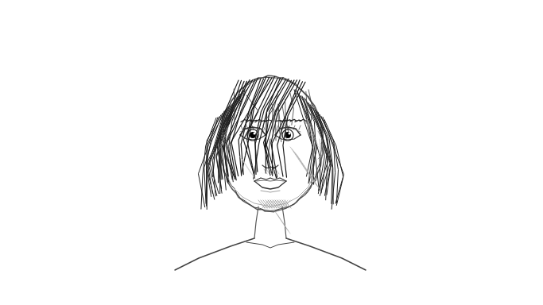

# JS Paint Drawing Skills for Claude Code

Claude Code learns to draw in [JS Paint](https://jspaint.app/) using browser automation — reverse-engineering the experiments from [AllAboutAI's video](https://www.youtube.com/watch?v=pEQvElSxKOk).

## Demo

https://github.com/user-attachments/assets/PLACEHOLDER-PENCIL-PORTRAIT-DEMO-MP4

## What This Is

A set of Claude Code skills that teach an AI agent how to paint on JS Paint through Chrome browser automation. The project explores two approaches:

- **Native Mode** — Dispatches pointer events through JS Paint's own Brush/Pencil tools. Strokes integrate with undo history, save/export, and the full tool system.
- **Canvas Mode** — Draws directly on the HTML5 `<canvas>` element via the Canvas 2D API. Full control over colors, line width, and shapes, but bypasses JS Paint entirely.

## Results

### Native Mode (JS Paint's tool system)

| Summer Night | Dog in Snow | Pencil Portrait |
|:---:|:---:|:---:|
|  |  |  |

### Canvas Mode (direct Canvas 2D API)

| Summer Night | Dog in Snow | Pencil Portrait |
|:---:|:---:|:---:|
|  |  |  |

## The Skills

Located in `.claude/skills/`:

| Skill | Purpose |
|-------|---------|
| `draw-on-jspaint.md` | Base skill — dual-mode drawing helpers (native + canvas), tool selection, color palette map |
| `oil-painting-technique.md` | Oil painting composition, layered brush strokes, color palettes for different scenes |
| `pencil-portrait-technique.md` | Pencil/charcoal portraits — face proportions, cross-hatching, grayscale shading |
| `compare-drawing.md` | Screenshot evaluation loop — draw, capture, assess, fix, repeat |

## Development Journey

The full story of how this was built — including a root cause analysis of a debugging misdiagnosis — is in [`development-journey.md`](development-journey.md).

**Key moments:**

1. **Video analysis** — Extracted skill structure, technique descriptions, and tool requirements from the video.
2. **Canvas mode paintings** — First working approach. Drew directly on the `<canvas>` element, bypassing JS Paint's tools.
3. **Root cause analysis** — Investigated why pointer events produced thin 1px lines. Found the cause: JS Paint defaults to the Pencil tool (1px), not the Brush. The fix was two lines of code.
4. **Native mode paintings** — Re-executed all 3 paintings through JS Paint's actual Brush/Pencil tools with full undo support.

## How It Works

```
Claude Code receives a drawing prompt
  → Reads skill files for technique guidance
  → Opens jspaint.app via Chrome MCP tools
  → Injects drawing helper (native or canvas mode)
  → Executes layer-by-layer drawing commands via javascript_tool
  → Takes screenshots to evaluate progress
  → Iterates until satisfied
```

## Acknowledgement

This project was inspired by the YouTube video **"Can Claude Code Learn To Draw In MS PAINT?"** by [AllAboutAI](https://www.youtube.com/@AllAboutAI):

[https://www.youtube.com/watch?v=pEQvElSxKOk](https://www.youtube.com/watch?v=pEQvElSxKOk)

The video demonstrates Claude Code iteratively learning to draw in JS Paint using browser automation and skills — an exploration of the "evolution style" approach to AI capabilities inspired by [Mo](https://www.youtube.com/@mo_statechange)'s talk on natural selection as a metaphor for software development.
